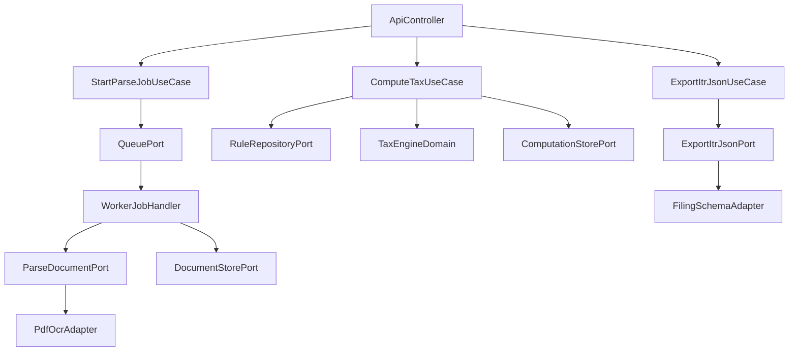

# OpenTax Phase-1 Target Architecture

## Architecture Objective
Build a deterministic, legally auditable, and maintainable system where domain computation remains pure and independent of frameworks, infrastructure, and external schemas.

## Dependency Rule (Non-Negotiable)
- Dependencies must point inward:
  - `interfaces/adapters` -> `application` -> `domain`
  - `domain` depends on nothing outside itself
- No module may import from a sibling adapter directly.
- Framework-specific code must not enter `domain`.

## Proposed Module Boundaries

### 1) Domain Layer (`packages/tax-engine`)
- Responsibility:
  - Pure tax calculation logic
  - Rule interpretation using validated in-memory rule artifacts
  - Deterministic output generation
- Allowed dependencies:
  - language runtime only
  - internal domain utilities
- Forbidden:
  - DB clients, HTTP clients, filesystem, framework decorators

### 2) Application Layer (`apps/api` and `apps/worker` use-cases)
- Responsibility:
  - Orchestrate workflows (compute, parse, export)
  - Transaction boundaries and idempotency
  - Mapping between transport DTOs and domain commands/results
- Depends on:
  - domain ports/interfaces
  - adapter abstractions, never concrete adapter internals

### 3) Adapter Layer (`packages/form16-parser`, `packages/itr-json`, infra adapters)
- Responsibility:
  - OCR/PDF parsing implementation
  - persistence implementation
  - government schema export mapping
  - message queue / object storage / DB adapters
- Depends on:
  - application contracts
  - external libraries/services

## Core Ports (Interfaces)
- `RuleRepositoryPort`: resolve rule artifact by AY and version
- `TaxComputePort`: compute tax for normalized input
- `ParseDocumentPort`: parse and normalize Form-16 data
- `ExportItrJsonPort`: map internal model -> filing-compatible output
- `DocumentStorePort`: persist and fetch document metadata/artifacts
- `ComputationStorePort`: persist deterministic computation artifacts

## Orchestration Model
- `POST /upload/form16` creates parse job, returns `jobId`.
- Worker consumes job, runs parser pipeline, persists extracted model and confidence metadata.
- `POST /tax/compute` uses normalized inputs + selected rule artifact, stores deterministic result with trace metadata.
- `GET /export/:id` calls export adapter from internal canonical model.

## Data Design Guardrails
- Keep two models:
  - Canonical internal typed model (source of business truth)
  - External filing schema model (adapter output only)
- Never reuse government schema as internal domain model.
- Store extraction provenance and confidence per field.

## SOLID/DRY Enforcement
- **SRP**:
  - Domain functions only compute and validate tax semantics.
  - Application services only orchestrate use-cases.
  - Adapters only handle external integration details.
- **OCP**:
  - New AY tax rule should be add-only via rule artifact, not core rewrite.
- **LSP/ISP**:
  - Keep ports narrow and behaviorally precise.
- **DIP**:
  - Application depends on abstractions (ports), not concrete parser/storage/export libs.
- **DRY**:
  - Single normalization contract for income/deductions.
  - Single rule-validation pipeline reused across compute and tests.

## Architecture Risks and Preventive Controls
- Risk: framework leakage into core domain
  - Control: static import restrictions and layer checks in CI.
- Risk: duplicate tax logic across API and worker
  - Control: all tax computation routed through one domain package.
- Risk: parser uncertainty polluting compute path
  - Control: enforce `NEEDS_REVIEW` gate before compute for low-confidence critical fields.

## Reference Flow

## Pre-Implementation Acceptance Checklist
- Layer boundaries approved.
- Port contracts approved.
- Async parsing workflow approved.
- Canonical vs external model split approved.
